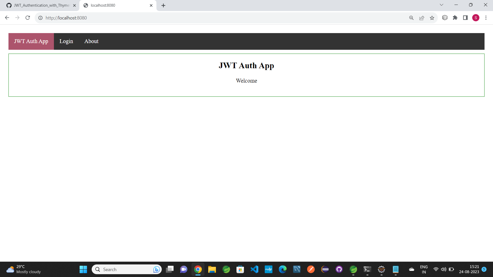
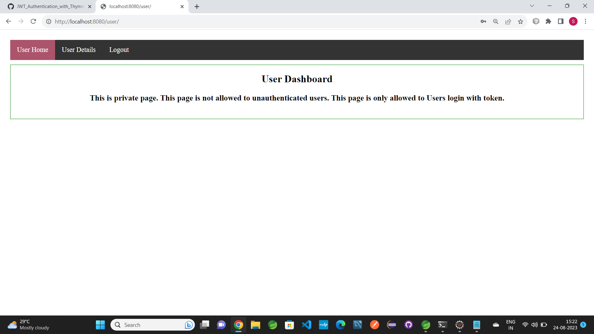
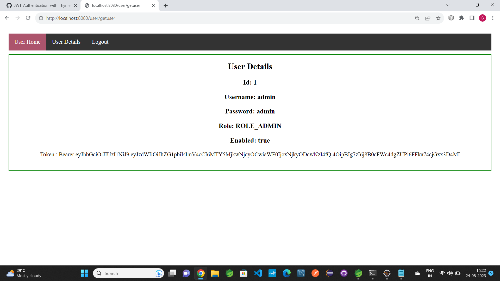

# JWT Authentication with Thymeleaf GUI
- It shows the working of JWT Token Authentication.
- It shows how user can login and logout using JWT Token Authentication.
- No database has been used. You can simply import the project and you dont need to do any configuration.

### It is SpringBoot Project. Build in Spring Tool Suite.

### Technology used in this Project: 
- i) Thymeleaf,CSS : designing page layout. 
- ii) Java : all the logic has been written in java. 
- iii) JWT Token: JWT Authentication has been user for authentication.
- iv) SpringSecurity: SpringSecurity has been used for authentication.

### Software And Tools Required:
- Java JDK 8+ 
- Eclipse EE or Spring Tool Suite
- MySQL

### Steps To Import And Run The Project in Eclipse EE
- In Eclipse or Spring Tool Suite
- Click on File
- Select Import
- Select Projects from Git(with smart import) -> Next
- Select Clone URI -> Next
- In URI paste this url: https://github.com/swapnilbamble1438/JWT_Authentication_with_Thymeleaf_GUI.git
  -> Next
-  Now in Local Destination

  - proceed -> Next

            Now only select JWT_Authentication_with_Thymeleaf_GUI\JWT_Authentication_with_Thymeleaf_GUI
            -> Finish
   
-  If everything goes right Project will get successfully imported
-  Now wait for few seconds for getting things properly loaded
- And Try to Run the Project

  ### If you are using Spring Tool Suite or Eclipse
 -  Right Click On Project > Run As > Spring Boot App 

### Some Screenshots of this Project:

==================================================================================================================================================================

==================================================================================================================================================================

==================================================================================================================================================================

==================================================================================================================================================================

==================================================================================================================================================================

### Project Creator: Swapnil Bamble

